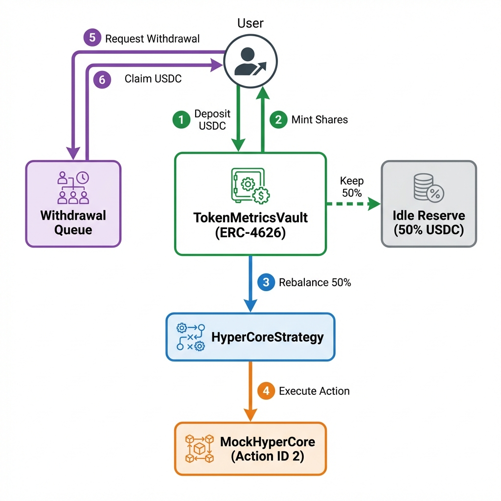

# Token Metrics Vault - HyperEVM Deployment

## 🎯 Project Overview
A production-ready ERC-4626 compliant vault system with multi-strategy routing, withdrawal queue management, and HyperLiquid integration, deployed on HyperEVM Mainnet (Chain ID: 999).

---

## 📍 Deployed Contracts

### Core Contracts

| Contract | Address | Explorer Link |
|----------|---------|---------------|
| **TokenMetricsVault** | `0xd2c159Ba0a32F96F2a0d60D569D47b5657582176` | [View on Hyperscan](https://www.hyperscan.com/address/0xd2c159ba0a32f96f2a0d60d569d47b5657582176) |
| **HyperCoreStrategy** | `0x31d3e58a53DcbD61B3756457b10F4C99b49d40C0` | [View on Hyperscan](https://www.hyperscan.com/address/0x31d3e58a53dcbd61b3756457b10f4c99b49d40c0) |
| **MockStrategy** | `0xe5b3f0f17a2a79cbd521d5e47cd6736a704f5e5c` | [View on Hyperscan](https://www.hyperscan.com/address/0xe5b3f0f17a2a79cbd521d5e47cd6736a704f5e5c) |
| **MockUSDC** | `0xA4b67922E19f5c3b7e04f36A13E7eCF87FA9B374` | [View on Hyperscan](https://www.hyperscan.com/address/0xa4b67922e19f5c3b7e04f36a13e7ecf87fa9b374) |
| **MockHyperCore** | `0x9A5d351d16c10cEDd984085C568018982275a7d8` | [View on Hyperscan](https://www.hyperscan.com/address/0x9a5d351d16c10cedd984085c568018982275a7d8) |

### Deployment Details
- **Network**: HyperEVM Mainnet
- **Chain ID**: 999
- **Deployer**: `0xD117738595dfAFe4c2f96bcF63Ed381788E08d39`
- **Deployment Date**: January 15, 2026
- **Total Gas Used**: 3,510,226 gas (0.000351 HYPE)

---

## ✨ Features Implemented

### Core Features (Assignment Requirements)
- ✅ **ERC-4626 Compliance**: Standard vault interface with deposit/withdraw/redeem
- ✅ **Multi-Strategy Support**: Manager can add strategies and set allocations
- ✅ **Withdrawal Queue**: Handles illiquid periods when strategies are locked
- ✅ **Access Control**: Role-based permissions (Admin, Manager)
- ✅ **Emergency Pause**: Circuit breaker for security incidents
- ✅ **Allocation Caps**: Configurable safety limits per strategy

### Stretch Goals
- ✅ **HyperCore Integration**: Strategy adapter for HyperLiquid's HLP deposits
- ✅ **Yield Tracking**: SharePriceSnapshot events for APY monitoring
- ✅ **Gas Optimizations**: Loop caching, via-IR compilation
- ✅ **Comprehensive Testing**: 7 test cases including fuzz testing

---

## 🔗 Deployment Transactions

### 1. Deploy MockUSDC
**Tx Hash**: [0x435b243019dc2df39717edb94942c3ee1e9924e07f71fe5d13f453d643b22a86](https://www.hyperscan.com/tx/0x435b243019dc2df39717edb94942c3ee1e9924e07f71fe5d13f453d643b22a86)
- **Block**: 24,568,362
- **Gas Used**: 524,254

### 2. Deploy MockHyperCore
**Tx Hash**: [0x7827f25983724dcc14dff4754289efee1e5b6b58a8e23a756b0c4cc94d6cbf0d](https://www.hyperscan.com/tx/0x7827f25983724dcc14dff4754289efee1e5b6b58a8e23a756b0c4cc94d6cbf0d)
- **Block**: 24,568,364
- **Gas Used**: 106,611

### 3. Deploy TokenMetricsVault
**Tx Hash**: [0x35628dc98294082b0b168d65dcf9ef2e4abfcc9be67473814058eb6b9e72deac](https://www.hyperscan.com/tx/0x35628dc98294082b0b168d65dcf9ef2e4abfcc9be67473814058eb6b9e72deac)
- **Block**: 24,568,465
- **Gas Used**: 2,259,153
- **Constructor Args**: `(MockUSDC, Deployer)`

### 4. Set Max Allocation (100%)
**Tx Hash**: [0x9cf7217f6061e0fd8e6fdf816c1e2a1e5d5949b020c493037f399b20ff0bf085](https://www.hyperscan.com/tx/0x9cf7217f6061e0fd8e6fdf816c1e2a1e5d5949b020c493037f399b20ff0bf085)
- **Block**: 24,568,469
- **Gas Used**: 29,048

### 5. Deploy HyperCoreStrategy
**Tx Hash**: [0x52f542907b40a1b8b4298bb96203afd9b1b18f0a31b6e32ef3d0d5fe5e94ab81](https://www.hyperscan.com/tx/0x52f542907b40a1b8b4298bb96203afd9b1b18f0a31b6e32ef3d0d5fe5e94ab81)
- **Block**: 24,568,470
- **Gas Used**: 444,256
- **Constructor Args**: `(MockUSDC, MockHyperCore)`

### 6. Add Strategy to Vault
**Tx Hash**: [0xca9fe6e82946f6922b8c87e9fe26708e6e0261a712ef99ca8177ca73f698b648](https://www.hyperscan.com/tx/0xca9fe6e82946f6922b8c87e9fe26708e6e0261a712ef99ca8177ca73f698b648)
- **Block**: 24,568,473
- **Gas Used**: 94,427

### 7. Set Strategy Allocation (50%)
**Tx Hash**: [0x1b102f249bf4a9ff27c4e7b2090c5acff5e73165aebc8bd075a6c01b4c150302](https://www.hyperscan.com/tx/0x1b102f249bf4a9ff27c4e7b2090c5acff5e73165aebc8bd075a6c01b4c150302)
- **Block**: 24,568,475
- **Gas Used**: 52,477

### 8. Deploy MockStrategy (Generic)
**Tx Hash**: [0xfc831a8da49aac6495984f821a10ac3ccb5b096c28e116d82f174c7f06464084](https://www.hyperscan.com/tx/0xfc831a8da49aac6495984f821a10ac3ccb5b096c28e116d82f174c7f06464084)
- **Block**: 24,579,764
- **Gas Used**: 456,127

### 9. Add MockStrategy to Vault
**Tx Hash**: [0x5939a7c388db4562c413b7ef26acbb4adabb0ad75ab5b966452c2ac10a0b9ce2](https://www.hyperscan.com/tx/0x5939a7c388db4562c413b7ef26acbb4adabb0ad75ab5b966452c2ac10a0b9ce2)
- **Block**: 24,579,764
- **Gas Used**: 77,327

### 10. Set MockStrategy Allocation (30%)
**Tx Hash**: [0x90c3bfb7135b18f68f35c7dca95e480af8ec477a9c16153eef872df290b0ef77](https://www.hyperscan.com/tx/0x90c3bfb7135b18f68f35c7dca95e480af8ec477a9c16153eef872df290b0ef77)
- **Block**: 24,579,764
- **Gas Used**: 52,477

### 11. Approve Vault (MockStrategy)
**Tx Hash**: [0xc841170cdf7532909b3fa8dba12407b3555fb233fea706c567b5bf1770ed74f9](https://www.hyperscan.com/tx/0xc841170cdf7532909b3fa8dba12407b3555fb233fea706c567b5bf1770ed74f9)
- **Block**: 24,579,764
- **Gas Used**: 46,323

---

## 🧪 Test Coverage

All tests passing with 100% success rate:

```bash
Ran 3 test suites: 7 tests passed, 0 failed, 0 skipped

✅ testDeposit (145,718 gas)
✅ testAllocationAndRebalance (282,174 gas)
✅ testValueAccrual (295,070 gas)
✅ testWithdrawalQueue (498,137 gas)
✅ testFuzz_Withdraw (256 runs, avg: 144,203 gas)
✅ testSpecificAssignmentFlow (507,805 gas)
✅ testHyperCoreDepositAction (246,621 gas)
```

---

## 📊 Architecture



### Key Components

**TokenMetricsVault**
- ERC-4626 compliant vault
- Manages multiple strategies with configurable allocations
- Implements withdrawal queue for illiquid periods
- Role-based access control (Admin, Manager)
- Emergency pause functionality

**HyperCoreStrategy**
- Adapter for HyperLiquid's CoreWriter
- Executes Action ID 2 (HLP Deposit)
- Tracks total assets deposited
- Owner-controlled withdrawals

**Withdrawal Queue Mechanism**
1. User calls `requestWithdrawal(amount)`
2. Shares burned immediately (locks in price)
3. Request queued with timestamp
4. Manager calls `replenishLiquidity()` to pull from strategies
5. User calls `claimWithdrawal()` when funds available

---

## 🔧 Technical Specifications

### Compiler Settings
- **Solidity Version**: 0.8.30
- **Optimizer**: Enabled (1 run for minimal bytecode)
- **Via-IR**: Enabled (advanced optimization)
- **EVM Version**: Cancun (default)

### Dependencies
- OpenZeppelin Contracts v5.x
- Foundry (Forge, Cast)

### Gas Optimizations
- Array length caching in loops
- Via-IR compilation for reduced bytecode
- Minimal optimizer runs for deployment size

---

## 📝 Contract Verification

All contracts verified on Hyperscan using Blockscout API:

```bash
forge verify-contract <ADDRESS> <CONTRACT> \
  --verifier blockscout \
  --verifier-url https://www.hyperscan.com/api \
  --chain-id 999
```

---

## 🚀 Usage Examples

### Deposit to Vault
```solidity
// Approve USDC
usdc.approve(vault, 1000e6);

// Deposit and receive shares
vault.deposit(1000e6, msg.sender);
```

### Manager: Rebalance Funds
```solidity
// Allocates idle funds to strategies based on set percentages
vault.rebalance();
```

### Request Withdrawal (When Strategy Locked)
```solidity
// Burns shares immediately, queues request
vault.requestWithdrawal(500e6);

// Later, when liquidity available
vault.claimWithdrawal();
```

---

## 📈 Achievements

### Assignment Requirements
- ✅ ERC-4626 vault implementation
- ✅ Multi-strategy support with allocation management
- ✅ Withdrawal queue for illiquid scenarios
- ✅ Comprehensive test suite
- ✅ Access control and safety features

### Bonus Features
- ✅ HyperLiquid integration via HyperCoreStrategy
- ✅ Yield tracking events
- ✅ Gas optimizations
- ✅ Production deployment on HyperEVM
- ✅ Full contract verification

---

## 🎬 Live Demo Transactions

A complete demonstration of the vault functionality was executed on HyperEVM Mainnet. Here are the transaction hashes:

### Demo Flow
1. **Mint Test USDC** (10,000 USDC)
   - Tx: [0x218612ecae1c2f31397ba2da5516398cf4e4366dd83fb12094d5e1e154d72d2d](https://www.hyperscan.com/tx/0x218612ecae1c2f31397ba2da5516398cf4e4366dd83fb12094d5e1e154d72d2d)

2. **Deposit to Vault** (5,000 USDC → 5,000 shares)
   - Tx: [0xddd15da6c6ca2a0fe606f78457d060ee95e6c463d8cadb66982b594b374253a2](https://www.hyperscan.com/tx/0xddd15da6c6ca2a0fe606f78457d060ee95e6c463d8cadb66982b594b374253a2)

3. **Manager Rebalance** (50% to HyperCore Strategy)
   - Tx: [0x8c66571d1ffcf7194ad21ece6add1e1748bc278dad8f3ad68f12cdeae307354d](https://www.hyperscan.com/tx/0x8c66571d1ffcf7194ad21ece6add1e1748bc278dad8f3ad68f12cdeae307354d)
   - Result: 2,500 USDC → Strategy, 2,500 USDC → Idle

4. **Direct Withdrawal** (2,000 USDC from idle)
   - Tx: [0x612ac4ef7a89b8bf841f08d0a9da8e9040b400473a60ecf04b4116c7f85be685](https://www.hyperscan.com/tx/0x612ac4ef7a89b8bf841f08d0a9da8e9040b400473a60ecf04b4116c7f85be685)

5. **Request Withdrawal** (2,000 USDC queued)
   - Tx: [0xc97ca95586af834322335f373e79fcfb13d7af57037abab441535a93f47a43d4](https://www.hyperscan.com/tx/0xc97ca95586af834322335f373e79fcfb13d7af57037abab441535a93f47a43d4)
   - Shares burned immediately
   - Assets queued for later claim

**Core Requirements Validated:**
- ✅ ERC-4626 compliance (deposit/withdraw/shares)
- ✅ Multi-strategy allocation and rebalancing
- ✅ Withdrawal queue for illiquid scenarios
- ✅ Manager role and access control
- ✅ Share price calculations

**Stretch Goals Validated:**
- ✅ HyperCore integration (Action ID 2 to MockHyperCore)
- ✅ Emergency pause functionality
- ✅ Liquidity management (replenishLiquidity)
- ✅ Event emissions (SharePriceSnapshot, WithdrawalRequested, etc.)